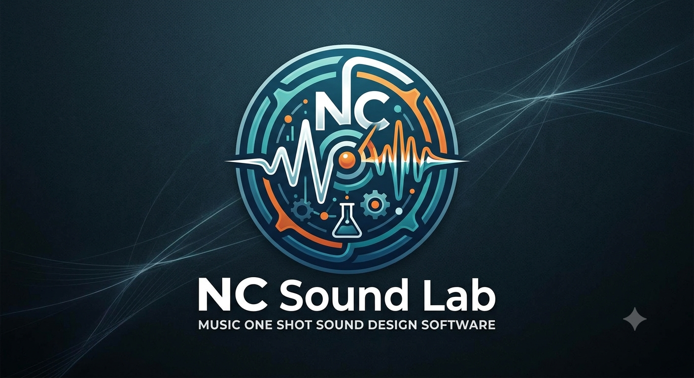

# NC Sound Lab

[](https://github.com/ncsound919/ncsoundlab/releases)
[](https://github.com/ncsound919/ncsoundlab/actions/workflows/ci.yml)

A web-based beatmaker and sound design workstation built with React, Vite, and the Web Audio API. Local-first — no accounts, no cloud, no API keys.



## Features

- **Sound Lab** — procedurally synthesize drums, 808s, leads, pads, textures and chaos-FX with a full chaos-synth DSP engine (ZDF ladder filter, hard-sync, unison, FM/RM, wavefolding, bitcrush, granular scatter).
- **Layer Mixer** — per-layer gain/pan/pitch, A/B soloing, FX chain (EQ, compressor, saturation, reverb, tape delay, chorus, transient shaper).
- **Compare Engine** — load a reference track and your mix, A/B switch with level matching, true EBU R128 / BS.1770-4 integrated loudness (via `bravoh-loudness`), peak/RMS meters, stereo width.
- **Sound Kit Catalog** — local catalog of published kits, favorites, procedural cover art (deterministic seed-based, no AI API), WAV export via JSZip.
- **Waveform Editor** — destructive DSP on selections (trim, normalize, pitch shift, saturation, bitcrush, reverb, stereo widening).
- **Studio Rack** — drag-and-drop FX modules: EQ, compressor, limiter, saturator, tape, exciter, delay, reverb, chorus, flanger, phaser, tremolo, imager.
- **Smart Randomizer** & **Evolution Engine** — generate mutations of any sample.
- **Local persistence** — kits, projects, and favorites stored in IndexedDB via Dexie. No server.

## Tech stack

- **React 19** + **Vite 6** + **TypeScript 5.8**
- **Tailwind CSS 4**
- **Zustand** (state), **lucide-react** (icons), **motion** (animations)
- **Web Audio API** (custom DSP — chaos synth, ZDF ladder, tape delay, convolution reverb)
- **[Meyda](https://github.com/meyda/meyda)** — spectral feature extraction (RMS, ZCR, spectral centroid) for sample analysis
- **[bravoh-loudness](https://www.npmjs.com/package/bravoh-loudness)** — BS.1770-4 / EBU R128 integrated LUFS for the Compare Engine
- **[Dexie](https://dexie.org/)** — IndexedDB wrapper for local persistence (no backend)
- **JSZip** — WAV + cover-art bundle export
- **Vitest 4** + **jsdom** + **Playwright** (unit + e2e)

## Quick start

**Prerequisites:** Node.js 20+ (developed on Node 24).

```bash
npm install
npm run dev          # http://localhost:3000
```

### Build for production

```bash
npm run build        # outputs to ./dist
npm run preview      # serve ./dist locally
```

### Lint, test, e2e

```bash
npm run lint         # tsc --noEmit
npm test             # vitest run (unit + component)
npm run test:coverage # vitest run --coverage (unit + coverage report)
npm run coverage:check # new-code coverage gate (>= 90% on added/modified code)
npm run test:e2e     # playwright test
```

### New-code coverage gate (90%)

The app enforces **90% statement coverage on new code** — not the whole legacy
app. `scripts/check-new-code-coverage.mjs` compares your diff against the
coverage report:

- **New files** must be ≥ 90% covered (whole file).
- **Modified files** must have ≥ 90% of their *added* lines covered.
- Import declarations and test files are excluded.

```bash
npm run test:coverage            # generate coverage/coverage-final.json first
npm run coverage:check           # checks the current working tree vs HEAD
COVERAGE_BASE=origin/main npm run coverage:check   # CI: check the PR diff
```

CI runs the gate on every push/PR (`origin/main...HEAD`). The overall app has a
modest global floor (`vitest.config.ts` → `coverage.thresholds`) so the suite
can't silently regress; the new-code gate is where the real requirement lives.

> Note: `git diff` line numbers are used, so run the check from a clean-ish
> tree (or against a base ref) for the most accurate signal. Untested
> in-flight work shows up as `FAIL` until its tests land — that is the gate
> working as intended. v8/istanbul source maps on this project misattribute a
> handful of genuinely-executed lines (component `useState` hooks, module-level
> `export const fn = …` arrows); the gate carries a small noise budget for that
> (see `COVERAGE_NOISE_ALLOWANCE`), and new files still need an 80% floor
> (`COVERAGE_NEW_MIN_PCT`).

> **Note on `evolutionEngine.test.ts`:** this suite forks a Vitest worker that, on some Windows sessions with a constrained virtual-memory commit (small/disabled pagefile, Memory Integrity + Mandatory ASLR, Defender scanning, or a parent job object with a per-process commit cap), is denied its first semi-space `VirtualAlloc` and aborts with `Committing semi space failed`. That is an OS-level commit denial, not a V8/Vitest issue. Set `CONSTRAINED_ENV=1` in the shell that runs `npm test` to skip it on the affected machine; on a healthy dev box or CI, leave it unset.

### Clean

```bash
npm run clean        # cross-platform: removes ./dist and ./server.js
```

## Configuration

No environment variables are required. The app is fully local-first:

- Sound kits, projects, and favorites are stored in IndexedDB (`soundlab-db` database).
- Cover art is generated deterministically from `(title, producer, era, seedOverride)` using the agent pipeline in `src/components/coverArtAgents.ts` — no external API.

The optional `CONSTRAINED_ENV=1` env var is only used to skip the OS-sensitive test described above.

## Deployment

NC Sound Lab is a static SPA that ships in two forms:

- **Public web demo** (Vercel) — the full tool, hosted so anyone can try it.
- **Desktop product** (Tauri) — a native Windows EXE for paid private copies; runs offline, all data stored locally.

### Desktop (Tauri)

Prerequisites: Rust (stable) + WebView2 Runtime (preinstalled on Windows 10/11).

```bash
npm install
npm run tauri:dev     # run in dev (Vite + WebView2 window)
npm run tauri:build   # production build
```

Outputs:

- `src-tauri/target/release/nc-sound-lab.exe` — portable executable
- `src-tauri/target/release/bundle/nsis/*-setup.exe` — Windows installer

The desktop build is fully self-contained and offline. Kits, projects, and favorites persist locally via IndexedDB in the app's own WebView2 data folder.

#### AAF export / import (Pro Tools)

The Produce stage's **AAF** panel (desktop build only) exports every audible
layer as a single self-contained `.aaf` — one audio track per stem, embedded
PCM — and can import an `.aaf` back to recover tracks for A/B / tempo work.
The writer emits a real SMPTE ST 377-1 AAF (OLE Compound File Binary) built on
the `cfb` crate, byte-validated against pyaaf2.

**Manual Pro Tools smoke test** (after `npm run tauri:build`):

1. In the desktop app, Produce stage → AAF → Export (choose length).
2. In Pro Tools: `File → Import → AAF…`, pick the `.aaf`.
3. Confirm: one audio track per stem, at 48 kHz / 24-bit, clips start at 0,
   no missing-media errors (PCM is embedded), and each clip plays back.

### Web demo (Vercel)

The `vercel.json` in the repo root configures the SPA rewrite (deep links return `index.html`) and serves production security headers. Deploy with:

```bash
npm run build
vercel --prod
```

Or connect the repo to Vercel and it auto-detects Vite (build command `npm run build`, output `dist`).

### Demo gate & $5 one-time purchase

The web build ships as a **free, timed 20-minute demo**. Flow:

1. A first-time visitor gets a **welcome modal** explaining the free session.
2. A **countdown pill** ticks in the header while they jam (20 minutes, wall-clock based — refreshing doesn't reset it).
3. When time's up, a **paywall modal** prompts them to buy the full desktop app for a **one-time $5** — no accounts, no memberships.
4. Purchasers can unlock the web demo on a browser via the "Already purchased?" link (honor-system; the real product is the offline desktop EXE). After checkout, the Windows installer is published at [GitHub Releases](https://github.com/ncsound919/ncsoundlab/releases).

The desktop (Tauri) build is **not** gated — it's the full product.

**Wire up Stripe** (one-time, no backend required):

1. In your Stripe Dashboard, create a **Product** priced at **$5.00** (one-time).
2. Create a **Payment Link** for it.
3. Paste the full `https://buy.stripe.com/...` URL into `PURCHASE_URL` in `src/lib/demoConfig.ts`.
4. Adjust the session length in `DEMO_SESSION_MS` (same file) if you want a different trial.

> Note: `vibeserve_stripe_create_payment` (Stripe MCP) creates Payment *Intents*, which need a backend + publishable key — not suitable for this static, local-first app. A hosted Payment Link is the right fit.

### Static hosting (alternative)

Build the production bundle and serve the `dist/` folder:

```bash
npm run build
```

Then deploy `dist/` to any of:

- **GitHub Pages** — push `dist/` to the `gh-pages` branch
- **Netlify** — connect your repo; Netlify auto-detects Vite builds
- **AWS S3 + CloudFront** — sync `dist/` to an S3 bucket with static website hosting
- **Any static host** — upload the contents of `dist/`

### Security headers

A `.headers` file, `nginx.conf`, and `vercel.json` header config are included with recommended security headers (CSP, HSTS, X-Frame-Options). Apply these in your hosting platform's header configuration.

### Fonts

All fonts are self-hosted in `public/fonts/` — no external CDN dependency.

## Project structure

```
src/
  audio/           # AudioEngine, CompareEngine, SoundLayerPlayer, dsp/ (AnalogEngineDSP, TapeDelayDSP, ConvolutionReverbDSP, AdvancedCompressor, AdvancedParametricEQ)
  components/       # React UI
  lib/              # Audio utils, Dexie DB, batch audio processor, chaos synth, evolution engine, sound presets
  store/            # Zustand stores (rack, compare engine)
  tests/            # vitest setup (jsdom mocks for AudioContext)
  types.ts          # All shared TypeScript types
public/
  logo.png          # Brand logo (used in sidebar + top header)
  fonts/
    fast-blaze.otf  # Brand display font (`.font-fastblaze` utility)
e2e/                # Playwright e2e specs
```

## Brand assets

The app's display font and logo are local-first too:

- `public/fonts/fast-blaze.otf` → exposed as the CSS font `Fast Blaze`, used via the `font-fastblaze` Tailwind utility (`src/index.css`).
- `public/logo.png` → referenced as the favicon (`index.html`) and as the brand mark in the sidebar and workspace header (`src/App.tsx`).

## License

Apache-2.0 — see source file headers (`SPDX-License-Identifier: Apache-2.0`).
